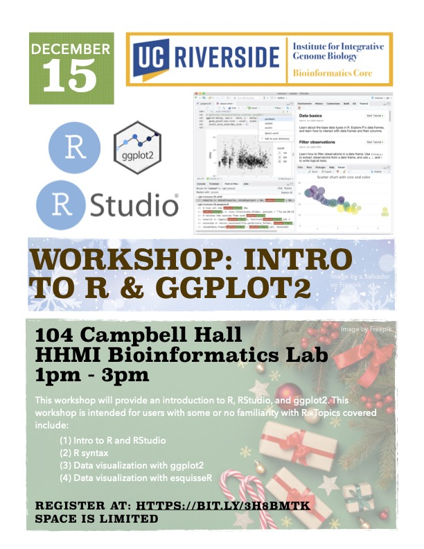

# Intro-to-R-RStudio

<figure>

</figure>

This workshop will provide an introduction to R, RStudio and data visualization using ggplot2. This workshop is intended for beginner users with some or no familiarity with R. Topics covered in this workshop includes:

- R and RStudio interface  
- R Syntax  
- Visualization using ggplot2  
- Visualization with esquisse  

# General Information  
**Date:** December 15, 2022  
**Time:** 1PM - 3PM  
**Location:** 104 Campbell Hall   
**Format:** In-Person

>**Update:** Location changed to Genomics Auditorium 1102A 

# Registration
Register for the workshop at: https://bit.ly/3h8bMtK

# Software installation
For this workshop, you will need to install R and RStudio Desktop. See the installation instructions here: [Installing R](code/installing-R.md)

# Workshop Resources
All materials for the workshop are available at the GitHub Repository:
https://github.com/bioinformatics-workshop/

# Requirements
Attendees should have a laptop (Mac or PC) to follow along in the workshop. If you don’t have a laptop, you can check one out at the [Tomas Rivera](https://library.ucr.edu/libraries/tomas-rivera-library) or [Orbach Science Library](https://library.ucr.edu/libraries/orbach-science-library). Go to the library circulation desk for more information.

**Mac Users:** The MacOS have a built-in terminal program for the command line interface and requires no additional software installation.

**PC Users:** The WinOS does not automatically come with a terminal/shell system pre-installed. For Windows 10 and 11 users, you can follow the instructions in this [link](https://itsfoss.com/install-bash-on-windows/) to install the Linux Bash Shell onto your system.

