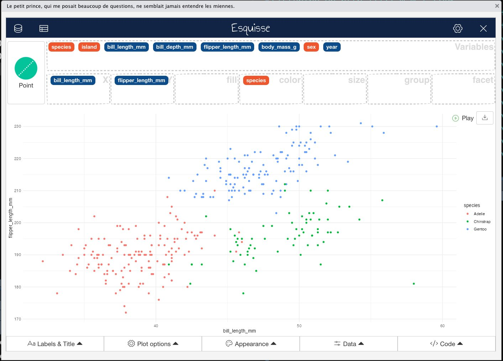

# esquisse: Exploring and visualizing data interactively

<figure>



</figure>

## What is esquisse?
A 'shiny' gadget to create 'ggplot2' figures interactively with drag-and-drop to map your variables to different aesthetics. You can quickly visualize your data accordingly to their type, export in various formats, and retrieve the code to reproduce the plot.

The purpose of this add-in is to let you explore your data quickly to extract the information they hold. You can create visualization with {ggplot2}, filter data with {dplyr} and retrieve generated code.

## Resources
---
Online documentation: https://dreamrs.github.io/esquisse/index.html  
Getting started: https://cran.r-project.org/web/packages/esquisse/vignettes/get-started.html

## Installation
---
Install from CRAN with: 
```
install.packages('esquisse')
```

>Note: This could take a few minutes to complete

## Running esquisse
---
After the installation, `esquisse` can be launched using the RStudio addin module or with:
```
esquisse::esquisser()
```

